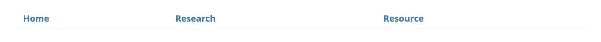
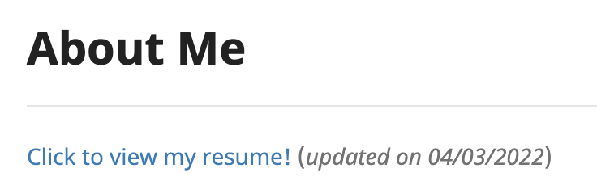

# Snoide's Personal Website

Hi there, welcome to Snoide's personal website! Check out at [this link](https://snoidetx.github.io/) to view it!

## User Guide

There are three main sections in the website, **[Index](https://snoidetx.github.io/index)**, **[Research](https://snoidetx.github.io/research)** and **[Resource](https://snoidetx.github.io/resource)**.
**Index** section is basically an introduction to myself; 
**Research** section introduces my past research done;
**Resource** section lists the academic resources prepared by myself.
You can switch between sections by clicking the three tabs at the top of the page:

### Section: *Index*

Lists my past academic, work and non-academic experience. In other words, it is my portfolio.

* **View my resume:** Click the *Click to view my resume!* link at the top of the page:

### Section: *Research*

Lists my past research done, including their abstracts, image previews and links to text.

* **View full text:** Click the link under the *Link to Full Text* subsections:

### Section: *Resource*

Lists the academic resources prepared by myself, including those in National University of Singapore (NUS) and those from Singapore Cambridge GCE A-Level Examination.

* **View resources that are coming soon:** Scroll to the *Module Forecast* section. The modules listed here represent those I am probably preparing resources for.
* **Access resources:** For each category of modules/subjects, there is a table consisting of two columns - name and resources (refering to the image below). To access the resources of a module/subject, navigate to the module/subject name and click the link of the resources you want to look at on the second column.

Roger!
