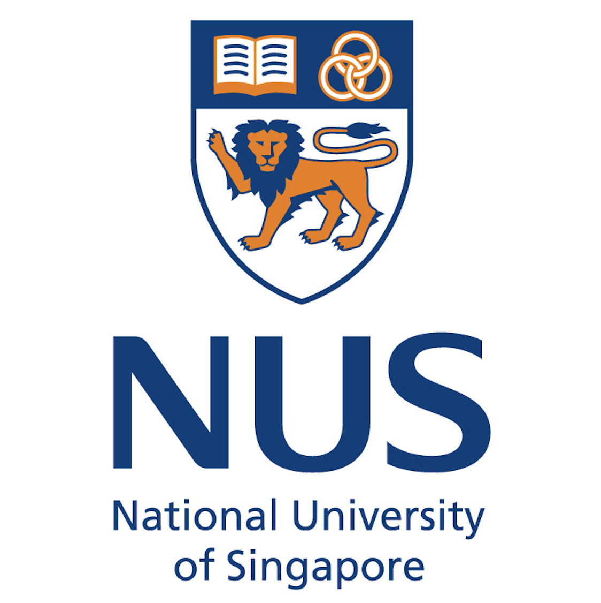
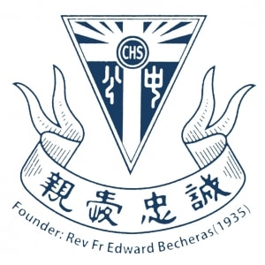
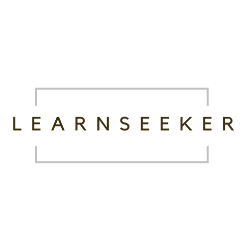

|  **[Home](https://snoidetx.github.io)**  |  **[Research](https://snoidetx.github.io/research)**  |  **[Resource](https://snoidetx.github.io/resource)**  |

(65) 8510 6059 • tianxiao02@u.nus.edu • [LinkedIn](https://www.linkedin.com/in/tian-xiao-1202/) • [Github](https://github.com/snoidetx/)    

---

# About Me (PAGE UNDER MAINTENANCE FROM 25/05/2022)

---

[Click to view my resume!](https://github.com/snoidetx/snoidetx.github.io/blob/main/cont/resume/tian-xiao-resume.pdf) (*updated on 28/03/2022*)

---

## Education

|  | National University of Singapore |
| :-: | --- |
|  | **Bachelor of Science & Bachelor of Computing** Singapore · Aug 2020 - Present Full-time · Ongoing  • Applied Mathematics and Computer Science (Double Degree) • Expected Date of Graduation: May 2024 • CAP (Applied Mathematics): 4.96/5.00 • CAP (Computer Science): 5.00/5.00  **Awards and Honours**  • Science & Technology Undergraduate Merit Scholarship • Dean's List, Bachelor of Computing, AY2021/22 Semester 1 • Dean's List, Bachelor of Science, AY2021/22 Semester 1 • Cohort Top among 634 students, CS1010S Programming Methodology, AY2020/21 Semester 1 • Cohort Top among 435 students, CS1231 Discrete Structures, AY2020/21 Semester 1  **Relative Modules Taken**  Artificial Intelligence · Calculus · Combinatorics and Graphs · Computer Organisation · Data Structure and Algorithms · Design and Analysis of Algorithms · Discrete Structures · Linear Algebra · Machine Learning · Mathematical Analysis · Numerical Analysis · Operating Systems · Probability · Programming Methodology · Regression Analysis · Software Engineering | 
|  | **Ridge View Residential College** Singapore · Aug 2020 - May 2022 Full-time · 1 yr 10 mos  • Led Project GreenFood@NUS in Action For Sustainability Symposium and achieved Best Project - Influencer Award • Completed RVRC Year One & Two Programme |

 

|  | National Junior College |
| :-: | --- |
|  | **Singapore Cambridge GCE A-Level Certificate** Singapore · Jan 2018 - Dec 2019 Full-time · 2 yrs  **Awards and Honours**  • Ministry of Education School-based Scholarship (SM1)  **Relative Modules Taken**  H2 Economics · H2 Further Mathematics · H2 Mathematics · H2 Physics |

 

|  | Catholic High School |
| :-: | --- |
|  | **Singapore Cambridge GCE O-Level Certificate** Singapore · Jan 2016 - Dec 2017 Full-time · 2 yrs  **Awards and Honours**  • Ministry of Education School-based Scholarship (SM1)  **Relative Modules Taken**  Additional Mathematics · Biology · Chemistry · Mathematics · Physics |

 

|  | Northeast Yucai School School |
| :-: | --- |
|  | **China Junior High School Graduation Certificate** Singapore · Sep 2011 - Oct 2015 Full-time · 4 yrs 2 mos |

 

---

## Work and Internship Experiences

|  | Singtel |
| :-: | --- |
|  | **Software Developer** May 2022 - Present Internship · Ongoing  • Developed cross-platform mobile applications as part of the mobile chapter |

 

|  | National University of Singapore |
| :-: | --- |
|  | **Teaching Assistant (CS2030/S)** Jan 2022 - Present Part-time · Ongoing  • Assisted professors in preparing and facilitating teaching of module CS2030 Programming Methodology II, a course to introduce fundamental programming methodology such as code design and coding style using Java involving more than 200 students • Supervised weekly laboratory sessions for students to get hands-on experience on applying certain methodologies and principles, reviewed their assignment submissions and gave feedbacks | 
|  | **Teaching Assistant (CS2040/S)** Aug 2021 - Present Part-time · Ongoing  • Assisted professors in preparing and facilitating teaching of module CS2040/S Data Structures and Algorithms, a course to equip students with knowledge on basic data structures and algorithms in computing using Java involving more than 450 students • Developed class materials and conducted weekly laboratory sessions for students to reinforce conceptual knowledge and get hands-on experience on using certain data structures and algorithms and marked their assignments |

 

|  | Learnseeker |
| :-: | --- |
|  | **Education Strategist & Creator** Oct 2021 - Jan 2022 Internship · 4 mos  • Facilitated the operation of LearnSeeker, an AI data visualisation and automatic grading tool for schools • Created digital education resources • Managed the classification and curation of education resources |

 

|  | Learnseeker |
| :-: | --- |
|  | **Researcher** Mar 2018 - Feb 2019 Internship · 1 yr  • Conducted research on possibilities of using Lock-in Thermography Technique to detect 3-dimensional geometries of an object and evaluated its practicability of being applied to real life scenarios • Computed Python algorithms (regression analysis & machine learning) to determine correlations within large datasets retrieved from Lock-in Thermography Technique • Collaborated with colleagues to predict general trends beyond pre-engineered prototypes |

 

---

## Co-curricular Activities and Volunteer Experiences
### NUS Mathematics Society, Publicity Director (May 2021 - Present)
-	Managed all publicity matters of NUS Mathematics Society to increase its uptake and improve its impact in order to benefit student community
-	Publicised NUS Mathematics Society in Orientation Camp and Student Life Fair via multiple social media platforms that recruited and retained around 120 members in total
-	Bridged communication on career information between around 1500 students, school departments and companies 

### NUS Teach Singapore, Academic Coach (Aug 2021 - December 2021)
- Provided academic coaching and mentoring to children and teenagers under Christ Church Secondary School Champions Youth Tuition Programme, as a member of NUS Teach Singapore initiative

### Peer Mentorship Programme, Chairperson (Nov 2018 - Aug 2019)
- Organised and chaired Peer Mentorship Programme to tutor disadvantaged children at Kebun Baru Community Centre
- Conducted mentoring sessions and facilitated talent development workshops for 50 children
- Arranged schedules of 22 members to ensure sufficient manpower

### School Chinese Orchestra and Guzheng Ensemble, Section Leader (June 2018 - June 2019)
- Headed Bowed Strings Section in Chinese Orchestra and facilitated major events as part of the Execution Committee
- Cooperated with conductors and other sections to achieve perfect coordination across orchestra and obtained a Certification of Distinction at Singapore Youth Festival 2019 Arts Presentation For Chinese Orchestra (Full Orchestra) - JC
- Organised activities and outings to promote camaraderie within whole orchestra involving about 100 members

### Citi-YMCA Youth for Causes: Project EOS, Chairperson (Feb 2018 - Oct 2018)
- Initiated and chaired Project EOS to raise funds and public awareness for underprivileged children in Singapore
- Partnered with Singapore Children’s Society for starting funds and necessary help in order to improve credibility and authority
- Communicated with members for creative marketing strategies and raised thousands of Singapore Dollars for underprivileged children

### School Chinese Drama, Student Director (Jan 2016 - June 2017)
- Directed drama shows and supervised script-writing, trainings and performances
- Consulted with Director, actors and 5 assisting units and was awarded a Certification of Distinction at Singapore Youth Festival 2017 Arts Presentation For Chinese Orchestra (Full Orchestra) - JC

 

---

## Additional Information
- **Languages:** English (Proficient), Mandarin (Native)
- **IT Skills:** Programming Languages (Bash, C, CSS, HTML, Java, JavaScript (with React and React Native frameworks), Kotlin, Python, TypeScript), Operating Systems (MacOS, Linux, Windows), Productive Softwares (Adobe Photoshop, Adobe Audition, Studio One)
- **Interests:** Basketball, Music, Fine Arts

---
